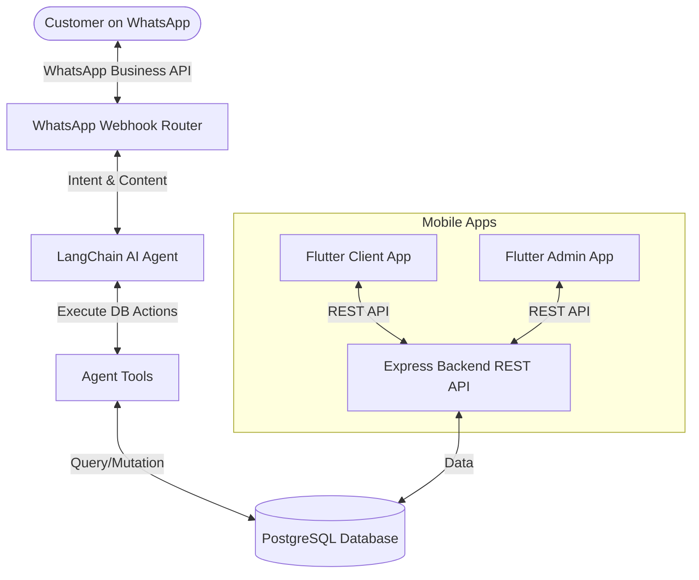

# 🚗 DriveConnect — Intelligent Car Rental Platform

<div align="center">


</div>

---

## 📌 Overview

**DriveConnect** is a modern, intelligent vehicle rental management platform designed to streamline operations and elevate customer experience. By integrating a **WhatsApp-based conversational AI Agent** with a robust, structured backend system and dedicated mobile applications, it ensures real-time vehicle dispatching, fast quotations, and instant secure payment confirmation.

The system leverages **Artificial Intelligence (AI)** and **Retrieval-Augmented Generation (RAG)** through LangChain and OpenAI to process conversations, extract intent, and interact directly with system databases.

---

## 🏗️ System Architecture

DriveConnect follows a modern, decoupled modular architecture:



### Key Components

*   **Backend REST API**: An Express application built with TypeScript that exposes endpoints for administrative actions, fleet management, reservations, and reporting.
*   **AI Agent Layer**: A LangChain-driven engine running on the ReAct (Reasoning and Action) framework. It automates client interaction, matches intents (e.g. check availability, register client, quote, book), and triggers safe programmatic tools to query database state.
*   **Cross-Platform Mobile Apps**: Written in Flutter, providing tailored experiences:
    *   **Customer Experience**: Tracking active rentals, viewing payment histories, and communicating.
    *   **Admin Dashboard**: Tracking revenue, managing fleet status, resolving reservations, and updating rental configurations.

---

## ✨ Features

### 🤖 Intelligent WhatsApp Chatbot
*   **ReAct Agent Loop**: Natural multi-turn conversations that guide users through quotations, requirements, and policies.
*   **Automated Database Interactions**: Programmatically checks vehicle availability, registers accounts, and reserves cars.
*   **Prompt-Injection Protection**: Sanitization layer protecting against prompts designed to alter AI behavior.
*   **PII Redaction**: Automatic stripping of passwords, emails, and full CPFs/Documents from application logs.

### 🚗 Vehicle & Fleet Management
*   **Conflict-Free Booking Engine**: Real-time availability validation prevents double-booking.
*   **Insurance & Pricing Options**: Dynamically calculates rental rates based on branches, season, dates, and selected insurance plans.

### 💳 Modern Payment Flow
*   **InfinitePay Integration**: Automatically generates checkout links and processes payment approvals/refunds securely.

---

## 🚀 Getting Started

### Prerequisites
*   Node.js (v18+)
*   Flutter SDK & Dart
*   PostgreSQL Database

---

### 💻 Backend Setup

1. Navigate to the backend directory:
   ```bash
   cd Backend
   ```

2. Install dependencies:
   ```bash
   npm install
   ```

3. Configure your environment:
   *   Copy `.env.example` to `.env`.
   *   Populate the required credentials (`OPENAI_API_KEY`, `DATABASE_URL`, etc.).

4. Run migrations and database seeding:
   ```bash
   # Initialize tables
   npm run db:init
   # Seed default branches and vehicles
   npm run db:seed
   ```

5. Start the development server:
   ```bash
   npm run dev
   ```

---

### 📱 Frontend Setup (Flutter)

1. Navigate to the frontend directory:
   ```bash
   cd Frontend
   ```

2. Fetch Flutter packages:
   ```bash
   flutter pub get
   ```

3. Run the application:
   ```bash
   flutter run
   ```

---

## 🧪 Testing

The Backend test suite utilizes **Jest** to run unit and integration tests.

```bash
cd Backend
npm test
```

---

## 📄 License

This repository is licensed under the MIT License. Developed for educational and demonstration purposes.
